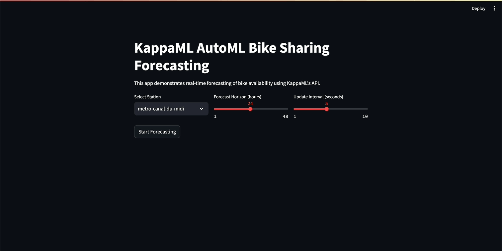

# KappaML Examples

Examples using [KappaML](https://kappaml.com) API.

Platform: https://kappaml.com
API Documentation: https://api.kappaml.com/docs
OpenAPI Schema: https://api.kappaml.com/openapi.json
API Keys: https://app.kappaml.com/api-keys

## Getting Started

Requirements:
- Python 3.10+
- pip

Install dependencies:

```bash
pip install -r requirements.txt
```

Get API key from https://app.kappaml.com/api-keys and set it as an environment variable:

```bash
export KAPPAML_API_KEY="your_api_key_here"
```

Run one of the following examples.

## KappaML API Regression Examples

### Python script
This example demonstrates how to use the KappaML API to perform regression tasks.

```bash
python regression/kappaml_api_regression.py
```

### Jupyter Notebook

```bash
jupyter notebook regression/kappaml_api_regression.ipynb
```

### Streamlit app

```bash
streamlit run regression/kappaml_api_regression_streamlit.py
```


## KappaML API Classification Example

### Streamlit app

```bash
streamlit run classification/kappaml_api_classification_streamlit.py
```


## KappaML API Forecasting Example

### Streamlit app

```bash
streamlit run forecasting/kappaml_api_forecast_streamlit.py
```



## KappaML API Anomaly Detection Example

TBA

## KappaML API Clustering Example

TBA
